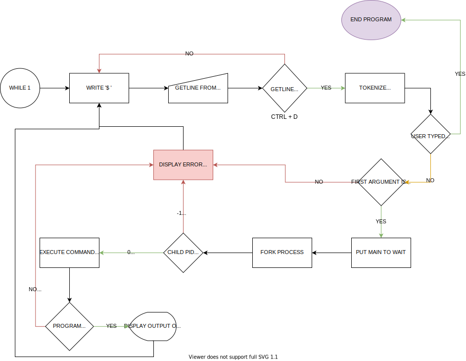

<p align="center">
  
</p>

# Bibalve - (kind of a shell)

Bivalve - The bivalves are a large class of molluscs, also known as pelecypods. They have a hard calcareous **shell** made of two parts or 'valves'. **The soft parts are inside the shell**.

A simple UNIX command interpreter written as final project of the first trimester at Holberton School. For more information about Holberton, visit [this link](https://www.holbertonschool.com/).

## Description.

**Bibalve** is a simple UNIX command language interpreter that reads commands and executes them.

## Project requirements.

- Allowed editors: vi, vim, emacs.
- All files will be compiled on Ubuntu 14.04 LTS.
- Your C programs and functions will be compiled with gcc 4.8.4 using the flags -Wall -Werror -Wextra and -pedantic.
- All your files should end with a new line.
- A README.md file, at the root of the folder of the project is mandatory.
- Your code should use the Betty style. It will be checked using betty-style.pl and betty-doc.pl.
- Your shell should not have any memory leaks.
- No more than 5 functions per file.
- All your header files should be include guarded.
- Use system calls only when you need to.

## List of allowed functions and system calls.

- ```access```
- ```chdir```
- ```close```
- ```closedir```
- ```execve```
- ```exit```
- ```_exit```
- ```fflush```
- ```fork```
- ```free```
- ```getcwd```
- ```getline```
- ```isatty```
- ```kill```
- ```malloc```
- ```open```
- ```opendir```
- ```perror```
- ```read```
- ```readdir```
- ```signal```
- ```stat```
- ```lstat```
- ```fstat```
- ```strtok```
- ```wait```
- ```waitpid```
- ```wait3```
- ```wait4```
- ```write```

### Execution

To execute **Bibalve**, compile all `.c` files in the repository and execute the resulting executable file:

```
gcc *.c -o Bibalve
./Bibalve
```
_Note_: there are two ways of using the command interpreter:

#### Interactive mode:
```
 $ ./hsh
($) /bin/ls
hsh main.c shell.c
($)
($) exit
$
```
#### Non-interactive mode:
```
$ echo "/bin/ls" | ./hsh
hsh main.c shell.c test_ls_2
$
$ cat test_ls_2
/bin/ls
/bin/ls
$
$ cat test_ls_2 | ./hsh
hsh main.c shell.c test_ls_2
hsh main.c shell.c test_ls_2
$
```

### Builtins
There are two builtins programmed into Bivalve. Below is a description and use for each builtin.

* `env` - The env command is a command that tells the shell program to display all of the environment variables with their values. It is a    way to access those values through the shell.

* `exit` - If you wish to exit out of the shell the user can use the builtin `exit`.


### Command Execution.

After receiving a command, **Bibalve** tokenizes it into words using `" "` as a delimiter. The first word is considered the command and all remaining words are considered arguments.
The shell searches for the command in the list of shell builtins. If there exists a builtin with that name, the builtin is invoked.
If the command is not a recognized builtin, **Bibalve** searches each element of the **PATH** environmental variable for a directory containing an executable file by that name.
If either of the above searches was successful, the shell executes the named program with any given arguments.

### Flow chart.



| File Name | Description and contents |
| --- | --- |
| [manpage](man_1_simple_shell) | This is the manpage for the Bivalve shell, this will help us know how to use the shell and the many uses of it, in here we can find examples and the correct sintaxis of the commands.|
| [shell.h](shell.h) |This is the header file where we can find all the prototypes of our functions.|
| [01-prompt.c](01-prompt.c) |main function - Prints the prompt in a loop and calls the functions to get an input line and handle the parameters.|
| [02-tokenize.c](02-tokenize.c) |tokenize - Receives a line as an input and stores space separated tokens (strings)|
| [03-strfunctions.c](03-strfunctions.c) |_strcmp, _strcpy, _strlen and _strncmp. These customized str functions compare, copy and return the length of strings.|
| [04-envirun.c](04-envirun.c) |_printenv, _getenv. These customized functions print thr 'env' command and get an enviromental variable.|
| [05-freeargv.c](05-freeargv.c) |Function to free argv (splitted tokens grid).|
| [06-exec.c](06-exec.c) |Receives an splitted line of strings and executes the program and it's arguments.|
| [07-linecheck.c](07-linecheck.c) |Previous line check.|
| [08-searchpath.c](08-searchpath.c) |Checks if command exists as builtin or tokenizes $PATH to find executable file.|


## Authors

* Ezequiel Martinez <[ezedksl](https://github.com/ezedksl)>
* Flavio Orlando <[flaviomco](https://github.com/flaviomco)>


<p align="center">
  
</p>